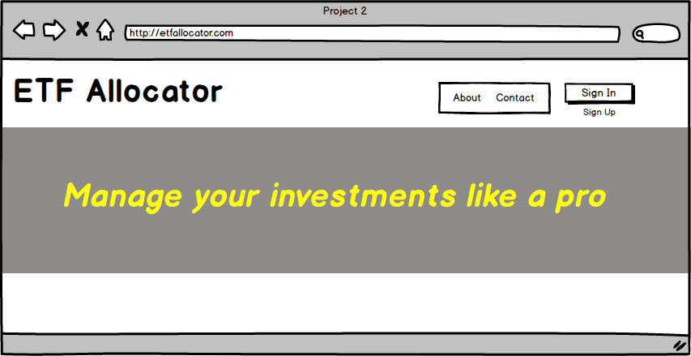
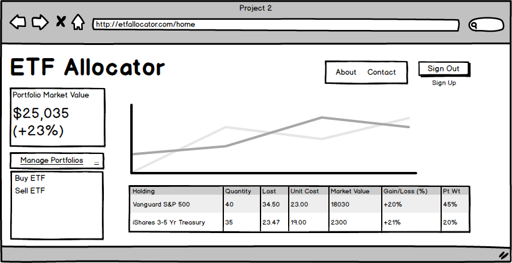
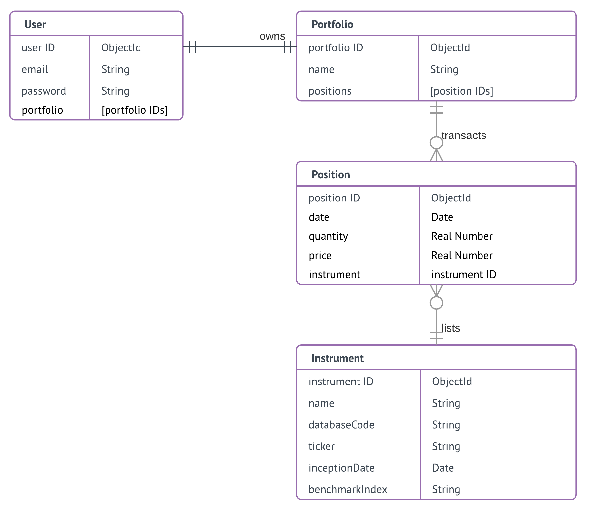

# ETF Allocator Beta

The ETF Allocator (in Beta stage) is a portfolio management tool for exchange-traded funds investors. It is meant to provide tools in portfolio allocation, monitoring, trading and risk management for ETF portfolios. This Beta version comprises these features: user authentication, portfolio overview, API link up for real ETF prices, and basic charting. 

## Live Version

Access the heroku deployment [here](https://etfallocator.herokuapp.com/) 

## Built With

What did you use to build it, list the technologies, plugins, gems, packages etc.

* [jQuery](http://jquery.com/)
* [Express](https://expressjs.com/) 
* [Mongoose](http://mongoosejs.com/)
* [Passport](http://passportjs.org/)
* [DataTables](https://datatables.net/)
* [MetricsGraphics.js](https://www.metricsgraphicsjs.org/)

## Workflow

**Wireframes**

Based on a one-week project timeline, I devised at the start the following wireframes as a visual reference to the scope of the project. 

 

Without signing in, a user enters the Welcome page when accessing etfallocator.com. After sign in, the user is directed to etfallocator.com/home and can view a list of her portfolio positions. She can then buy or sell each position. The latest end-of-day market price of each instrument will be displayed prior to transaction.

**Entity Relationship Diagram (Crow's Foot with Field Types)**

The header of each box represents the entitiy while the bottom right column and bottom left represent field names and field types respectively. The entities are defined with scalability in mind. For example, splitting User and Portfolio allows the design of one User to many Portfolios in the future although this Beta currently restricts to one and only one Portfolio for each User. In the future it may also be possible to extend one Portfolio to multiple Users for joint investment accounts or advised accounts.

A User can add multiple positions to her Portfolio. Each position is linked to one and only one instrument (quantity restricted to one unit in Beta).   

Instrument (i.e. an Exchange Traded Fund) is defined separately from Position. This facilitate maintenance as instrument data is sourced separately and may change over time independently from Positions.

## Acknowledgments

* Quandl Inc for US EOD data via API

